<div align="center">

# Multi-Scale Dilated Causal CNN for Financial Volatility and Risk Regime Forecasting on NIFTY Bank


</div>

<br>

| scatter GARCH_sigma | scatter log_GARCH_sigma |
| :---: | :---: |
| 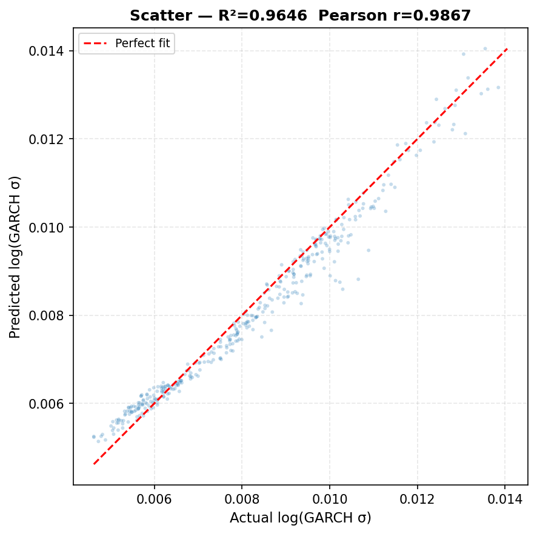 | 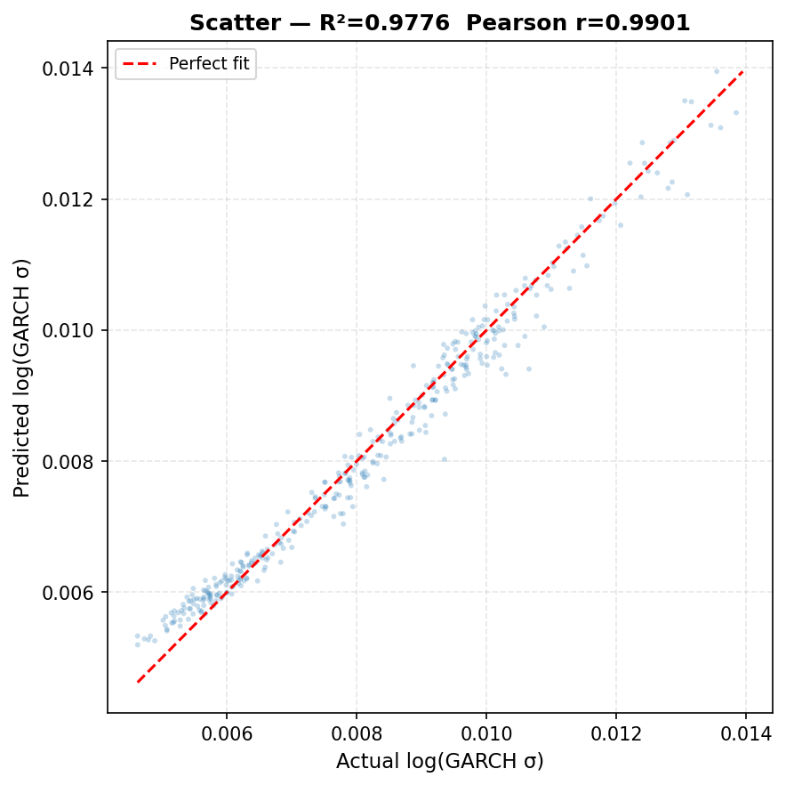 |

| Actual vs Predicted ||
| :---: | :---: |
| 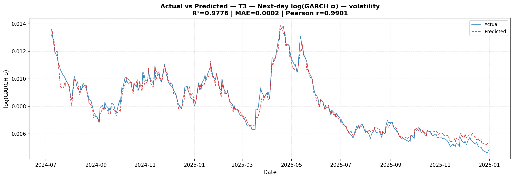 |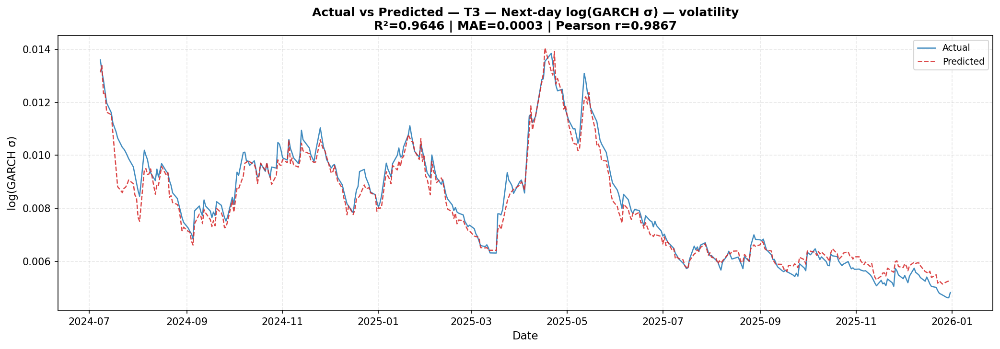 |
| 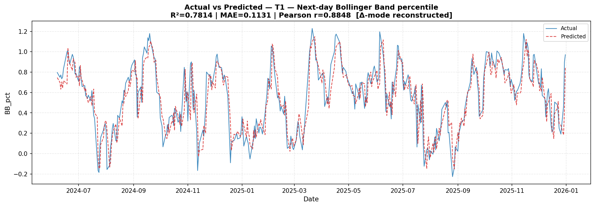 |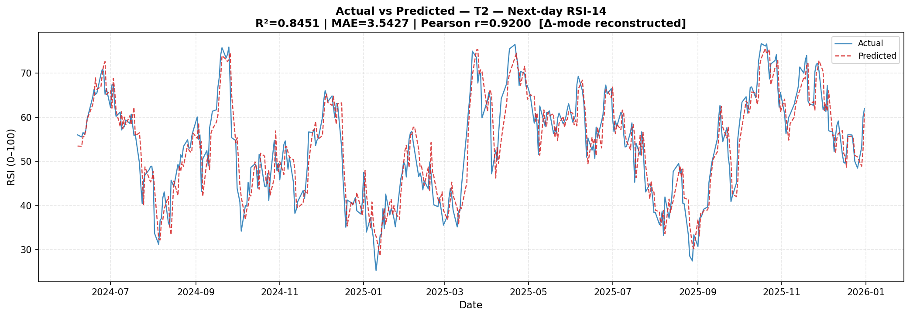  |


| Walk forward evaluation ||
| :---: | :---: |
| 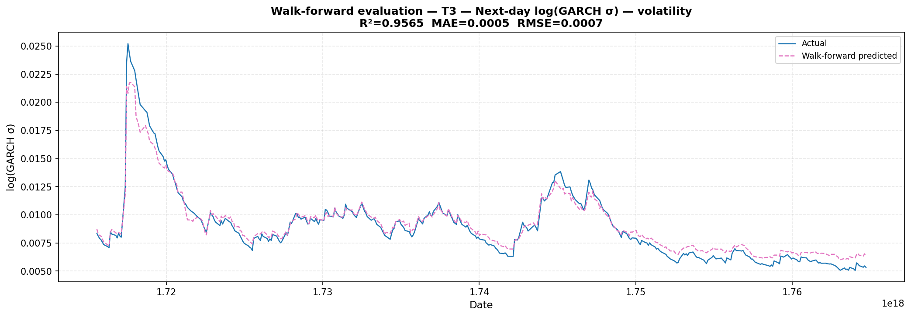 |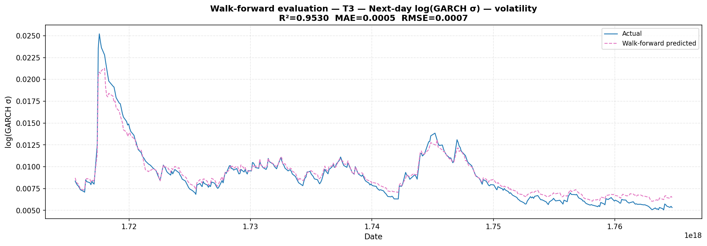 |
| 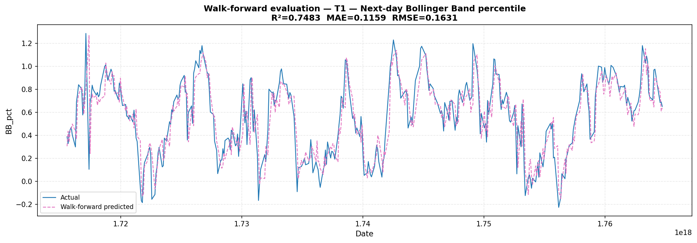 |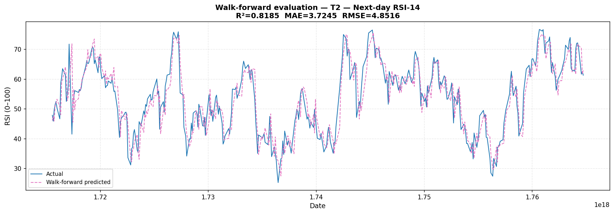  |

<br>

## Overview

This project explores whether a **convolutional architecture**, built around dilated causal convolutions, residual learning, and cosine-annealed training, can generalize across fundamentally different financial forecasting problems on the **NIFTY Bank index (2013-2026)**, enriched with India VIX features.

Rather than building five separate bespoke models, one configurable "Stochastic CNN" backbone is trained on **five targets**, spanning both regression and classification:

| Code | Target | Task | Description |
|:----:|--------|:----:|-------------|
| T1 | `BB_pct` | Regression | Next-day Bollinger Band percentile |
| T2 | `RSI_14` | Regression | Next-day RSI-14 momentum indicator |
| T3 | `log_GARCH_sigma` | Regression | Next-day log-GARCH volatility (σ) |
| T4 | `VaR_regime` | Classification | Next-day Value-at-Risk regime (calm / moderate / stressed) |
| T5 | `VolatilityRegime` | Classification | Next-day 3-class volatility regime |

<br>

## ✨ Highlights

- **One architecture, five tasks** a shared dilated-CNN backbone adapted per-target via residual-learning mode, dropout/L2 schedules, and window length
- **Walk-forward validated** no single static train/test split; performance is stress-tested across rolling time windows to avoid look-ahead bias
- **Cosine annealing with warm restarts** custom learning-rate schedule for stable convergence across long training runs
- **Gradient × Input interpretability** feature importance and temporal saliency heatmaps expose *which* features and *which* time steps drive each prediction
- **Rigorous benchmarking** every model is compared against a naive lag-1 baseline using R², directional accuracy, and Diebold–Mariano statistical tests

<br>

## Model Architecture

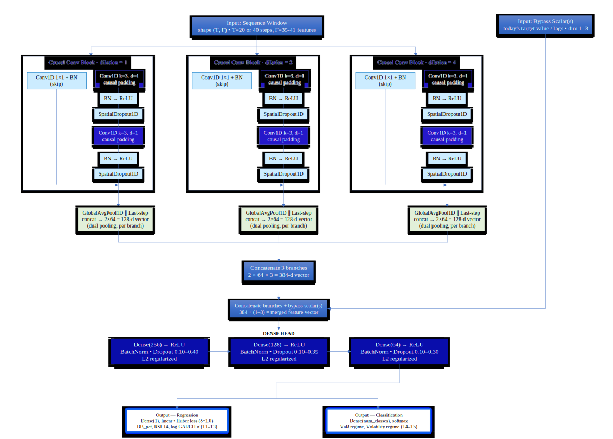

The backbone consists of stacked **dilated causal convolution blocks** (dilations `1 → 2 → 4`) for multi-scale temporal receptive fields, followed by spatial dropout, a dense head (`256 → 128 → 64`), and task-specific output layers (linear for regression, softmax for classification). Key design choices:

- **Residual learning mode** for smooth targets (`BB_pct`, `RSI_14`), the network predicts the *change* rather than the raw value
- **Target-adaptive regularization**, dropout and L2 strength scale with task difficulty (e.g. stronger regularization for the 3-class volatility regime)
- **Variable input windows**, 20-day lookback for momentum/oscillator targets, 40-day lookback for volatility targets

<br>

## Dataset & Feature Engineering

The model is trained on a feature-engineered NIFTY Bank dataset (2013–2026) combining:

- OHLCV price/volume history
- India VIX (implied volatility) series
- Technical indicators (RSI, Bollinger Bands, rolling volatility, GARCH-fitted σ)
- Rolling risk metrics (VaR, drawdown-based regime labels)

<br>

## Exploratory Data Analysis
# OHLC overview
<div align="center">
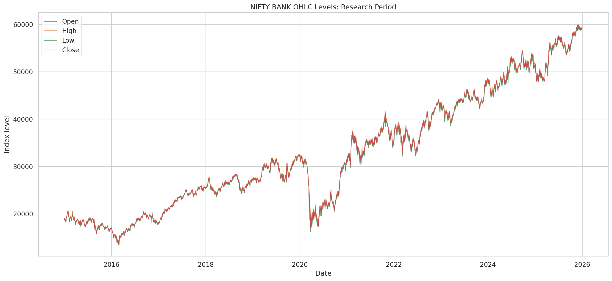
</div>
<br>

# Pearson Correlation Map
<div align="center">
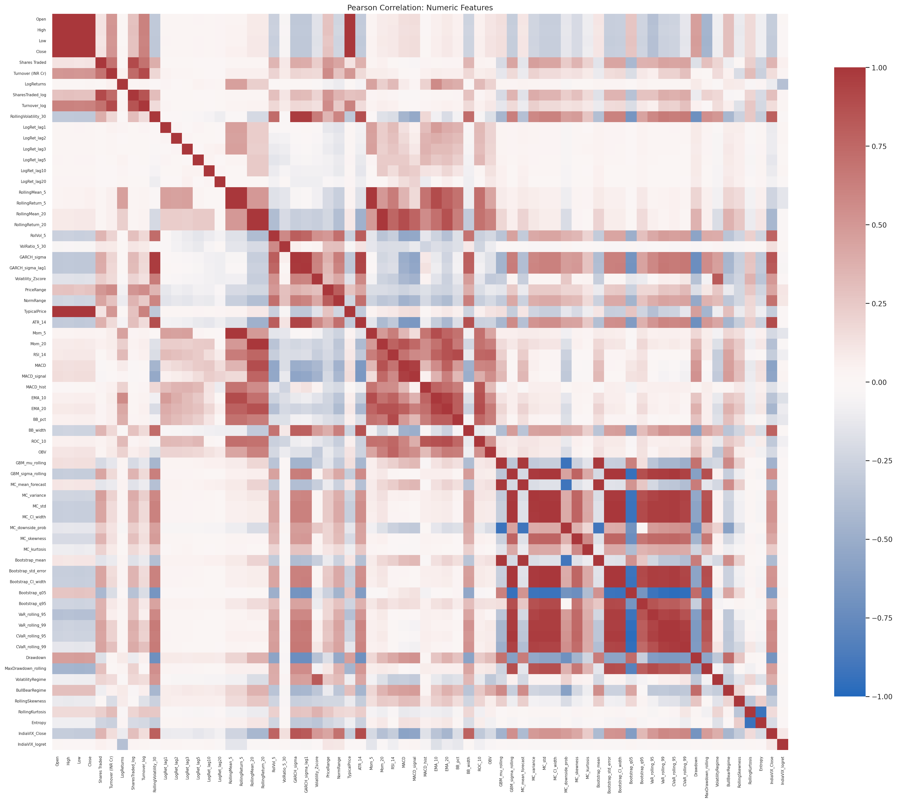
</div>
<br>

## Methodology

1. **Preprocessing** robust/quantile scaling, log-transform for skewed targets, sliding-window sequence construction
2. **Training** Adam optimizer with cosine-decay + warm restarts (`T₀ = 15` epochs, multiplier `2.0`), early stopping (patience 30), up to 300 epochs
3. **Evaluation** held-out test set **plus** rolling walk-forward validation (30-day step) to simulate real deployment conditions
4. **Baselines** every regression target is benchmarked against a naive lag-1 forecast, with statistical significance assessed via the Diebold–Mariano test
5. **Interpretability** post-hoc gradient × input feature attribution and temporal saliency mapping

<br>


## Results
<div align="center">
| Target | Task | R² | Dir. Acc (%) | Naive R² | Epochs |
|--------|:----:|:--:|:--:|:--:|:--:|
| `log_GARCH_sigma` | Regression | **0.978** | 70.7 | 0.967 | 264 |
| `GARCH_sigma` | Regression | 0.965 | 77.5 | 0.967 | 260 |
| `BB_pct` | Regression | 0.781 | 50.1 | 0.790 | 40 |
| `RSI_14` | Regression | 0.845 | 49.1 | 0.857 | 41 |
</div>
<br>

<div align="center">
| Target | Task | Accuracy | F1 (macro) |
|--------|:----:|:--:|:--:|
| `VolatilityRegime` | Classification | **0.935** | 0.931 |
| `VaR_regime` | Classification | 0.932 | 0.898 |
</div>
<br>
## 📁 Repository Structure


```
stochastic-cnn-financial-forecasting/
├── main/
    ├──Stochastic_CNN_Master.ipynb    # Main notebook (data → train → evaluate)
├── README.md
├── requirements.txt
├── figures/
├── eda/
└── output/
```

<br>

## Acknowledgements

This project was developed as part of a research internship, and is shared here as a personal portfolio piece with permission. All data used is derived from publicly available market sources.

<br>

## 📄 License

This project is licensed under the [MIT License](LICENSE).

<br>

## 🔗 Connect

<div align="center">

<!-- ================================================================ -->
<!-- INSERT: your LinkedIn / portfolio badges here -->
[]([https://linkedin.com/in/your-profile](https://www.linkedin.com/in/chilivary-vishal-580a2821b/))
<!-- ================================================================ -->

**⭐ If you found this project interesting, consider giving it a star!**

</div>
